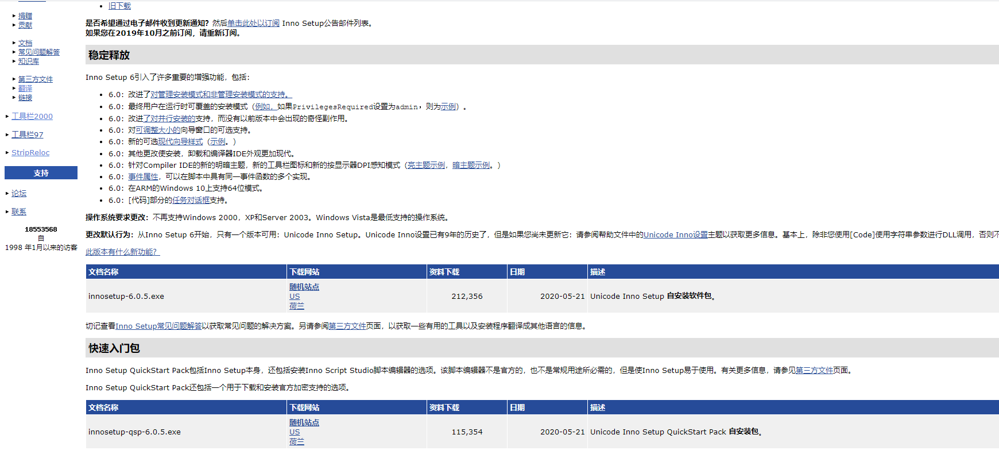

# InnoSetup 学习

## 为什么做安装包
* 如果用了.net 4.5开发 用户只有.new3.0 就没有办法正常运行版本 在用户打开的时候检测一下用户有没有我这需要环境
* 我需要把我的软件注册到系统当中，方便系统管理。
* 可以显示一些条款 同意才能使用
* 方便应用  开机启动  创建快捷方式， 界面选择语音
## 安装方式
```
https://jrsoftware.org/isinfo.php
```
